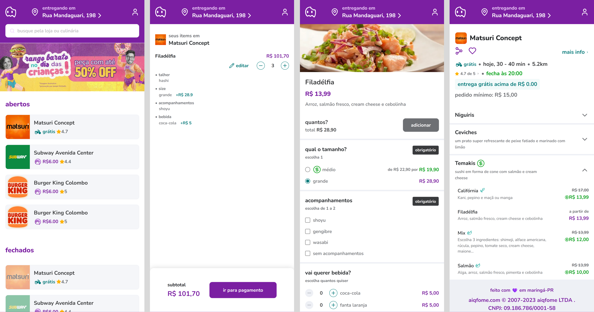

# Aiqfome Challenge

This project features an interface inspired by the Aiqfome delivery app. It simulates the user experience flow from accessing the application to the moment of proceeding to payment.

[[English](README.md) | [Portuguese](README.pt.md)]

<p align="center">
  
</p>

<h2 align="center">Table of Contents</h2>
<p align="center">
 <a href="#main-features">Main Features</a> •
 <a href="#project-structure">Project Structure</a> •
 <a href="#technologies-used">Technologies Used</a> •
 <a href="#libraries-and-tools">Libraries and Tools</a> •
 <a href="#installation-instructions">Installation Instructions</a> •
 <a href="#challenges-and-solutions">Challenges and Solutions</a> •
 <a href="#next-steps">Next Steps</a> •
 <a href="#support-and-questions">Support and Questions</a>

## Main Features

The application offers an intuitive and responsive interface, using dynamic routes through `Next.js` `App Router`, supporting parameterized URLs.

- Home Page:

  - Restaurant list: Displays a list of all restaurants, separated into open and closed. Each restaurant card shows initial information to help the user make their first decision (“where should I order from?”), such as the restaurant name, delivery fee, and rating;
  - Campaign banner: The banner and its alternative text can be dynamically modified. If there is a link, it redirects to the provided URL;
  - Layout: The home page also includes the restaurant search bar, as well as the standard header and footer.
    <br>

- Restaurant Page:

  - Header: Displays detailed restaurant information such as delivery time, distance from the restaurant, opening hours, minimum order for free delivery, and minimum order value;
  - Share button: Uses the `Web Share API` to send the restaurant’s name and URL. Since the application pages are managed dynamically, the URL directs the user straight to the selected page;
  - Menu: A collapsible list organized by restaurant item categories, showing if there is any product with a discount. When opened, it displays a list of menu items with basic information such as name, description, original price, promotional price (if any), and icons indicating if the item is vegetarian or spicy.
    <br>

- Product Page:

  - The basic product data is displayed at the top of the page, along with a photo if available;
  - Additional product options: all options are dynamically generated, separated into radio groups, multi-selection lists, and checklists.
  - Text area for notes;
  - If all items marked as mandatory are selected, the "view ticket" button appears, allowing the user to proceed to the order page.
    <br>

- Order page:

  - A página de pedido contém os items que foram selecionados exibindo informações básicas do pedido além de permitir a deleção de produtoe e/ou edição de um produto. A edição do produto carrega o pedido feito na poágina de produto novamente premitindo alterações nos dados;

  - The order page contains the selected items, displaying basic order information and allowing product deletion and/or editing.
  - Editing a product reloads the order on the product page, enabling data modifications.

## Project Structure

The project follows a modular and reusable structure, with components separated and organized into specific folders.

- All ui components were created in a "pure" way, without relying on external libraries (except for skeletons on the loading page);

```bash
/aiqfome-challenge
├── app/            # Application pages managed with App Router
├── components/     # Reusable components
│  ├─ shared        # Shared components
│  ├─ pages         # Pages components
│  └─ ui            # UI components
├── interfaces      # Data typing
├── public          # Static files
├── services        # API consumption logic
├── stores          # Global state management and custom hooks
├── utils           # Utility functions
├── .env            # Environment variables
└── README.md       # Project documentation
```

## Technologies Used

The project was developed using the following technologies:

### Front-end

- `Next.js v15.3.3`;
- `React v19.0.0`;
- `TypeScript v5.0.0`.

### Libraries and Tools

- `Tailwind CSS`;
- `ESlint`;
- `Prettier`;
- `Husky`;
- `Ant Desgin` (used only for skeletons);
- `Lucide React` icons.

### Back-end (Mock API)

- JSON Server: Used to simulate a complete REST API during development. It allowed the creation of a realistic testing environment without relying on a ready-made backend. All data is stored in a file named server.json;
- Configured endpoints:
  - `/restaurants`: fetch restaurant data;
  - `/categories`: fetch product categories;
  - `/products`: fetch product data;
  - `/banner`: fetch promotional banner.

## Installation Instructions

### Minimum requirements

- [node v20+](https://nodejs.org/pt)
- [yarn](https://yarnpkg.com/)

### Step-by-step

1. Clone the repository

```bash
git clone https://github.com/jvmoraesdev/aiqfome-challenge.git
```

2. Create the `.env` file based on `.env.example`
   <br>

3. Install the dependencies

```bash
yarn
```

3. Run the backend server

```bash
yarn server
```

4. Run the application

```bash
yarn dev
```

5. Access [http://localhost:3000](http://localhost:3000)

## Challenges and Solutions

### Responsividade

**Challenge:** Adapting the application to multiple devices, given that the original design is heavily focused on mobile users.

**Solution:** A flexible layout strategy was adopted, using responsive breakpoints to enhance the experience on larger screens such as tablets and desktops. The goal was to ensure that the interface remained functional and visually consistent, without losing the mobile-first essence of the design.

### Gerenciamento de Dados

**Challenge:** Efficiently managing locally persistent data, especially in the flow between the product page and the order review page.

**Solution:** Proper use of `localStorage` to maintain the cart state and selected options across the product and order pages. This allowed users to return to previous screens without losing their progress, even when refreshing the page or navigating between routes.

## Next Steps

- Add payments page;
- Implement login;
- Add test coverage;
- Add `Docker` compatibility;
- Perform API requests based on browser geolocation;
- Integrate with real APIs.

## Support and Questions

Any questions, please contact me via email [moraejosev@gmail.com](mailto:moraejosev@gmail.com), I will be happy to help!
