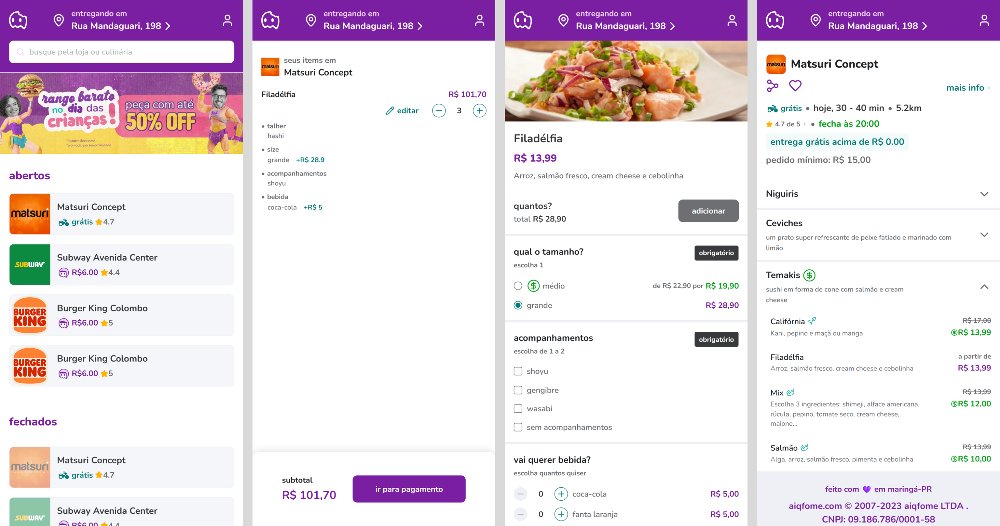

# Desafio Aiqfome

Este projeto conta com uma interface inspirada no aplicativo de delivery Aiqfome. Ele simula o fluxo da experiência do usuário desde o acesso à aplicação até o momento de envio para o pagamento.

[[Inglês](README.md) | [Português](README.pt.md)]

<p align="center">
  
</p>

<h2 align="center">Tabela de Conteúdo</h2>
<p align="center">
 <a href="#principais-funcionalidades">Principais Funcionalidades</a> •
 <a href="#estrutura-do-projeto">Estrutura do Projeto</a> •
 <a href="#tecnologias-utilizadas">Tecnologias Utilizadas</a> •
 <a href="#instruções-de-instalação">Instruções de Instalação</a> •
 <a href="#desafios-e-soluções">Desafios e Soluções</a> •
 <a href="#próximos-passos">Próximos Passos</a> •
 <a href="#dúvidas-e-suporte">Dúvidas e Suporte</a>

## Principais Funcionalidades

A aplicação oferece uma interface intuitiva e responsiva, com uso de rotas dinâmicas via `App Router` do `Next.js`, suportando URLs parametrizadas.

- Página Inicial:

  - Lista de restaurantes: Exibe uma lista com todos os restaurantes, separados entre abertos e fechados. Cada bloco de restaurante mostra informações iniciais para ajudar o usuário a tomar a primeira decisão (“onde vou pedir?”), como nome do restaurante, taxa de entrega e avaliação;
  - Banner de campanha: O banner e o texto alternativo podem ser modificados dinamicamente. Caso haja um link, ele redireciona para a URL recebida;
  - Layout: A página inicial também contém a barra de busca de restaurantes, além do cabeçalho e rodapé padrão.
    <br>

- Página de Restaurante:

  - Cabeçalho: Exibe as informações detalhadas do restaurante, como prazo de entrega, distância do restaurante, horário de funcionamento, pedido mínimo para gratuidade da taxa de entrega e valor mínimo do pedido;
  - Botão de compartilhar: Utiliza a `Web Share API` para enviar o nome e a URL do restaurante. Como as páginas da aplicação são gerenciadas de forma dinâmica, a URL leva diretamente para a página selecionada;
  - Lista colapsável organizada por categoria de itens do restaurante, exibindo se existe algum produto com desconto. Ao ser aberta, mostra uma lista dos itens do menu com suas informações básicas, como nome, descrição, valor original e valor promocional (caso haja), além de ícones que indicam se o item é vegetariano ou apimentado.
    <br>

- Página de Produto:

  - Os dados básicos do produto são exibidos no início da página, junto com uma foto, caso ela exista;
  - Opções adicionais do produto: todas as opções são geradas dinamicamente, separadas em grupos de rádio, listas de seleção múltipla e checklists;
  - Caixa de texto para observações;
  - Caso todos os itens marcados como obrigatórios sejam selecionados, o botão "ver ticket" é exibido, permitindo que o usuário seja direcionado para a página de pedido.
    <br>

- Página de Pedido:

  - A página de pedido contém os itens que foram selecionados, exibindo informações básicas do pedido, além de permitir a deleção de produtos e/ou edição de um produto;
  - A edição do produto carrega o pedido na página do produto novamente, permitindo alterações nos dados.

## Estrutura do Projeto

O projeto segue uma estrutura modular e reutilizável, com os componentes separados e organizados em pastas específicas.

- Todos os componentes de interface foram criados de forma "pura", sem a necessidade de bibliotecas externas (com exceção dos skeletons na página de carregamento).

```bash
/aiqfome-challenge
├── app/            # Páginas da aplicação gerenciadas com App Router
├── components/     # Componentes reutilizáveis
│  ├─ shared        # Componentes compartilhados
│  ├─ pages         # Componentes de páginas
│  └─ ui            # Componentes de interface (UI)
├── interfaces      # Tipagem de dados
├── public          # Arquivos estáticos
├── services        # Lógica para consumo de API
├── stores          # Gerenciamento de estado global e hooks customizados
├── utils           # Funções auxiliares
├── .env            # Variáveis de ambiente
└── README.md       # Documentação do projeto
```

## Tecnologias Utilizadas

O projeto foi desenvolvido utilizando as seguintes tecnologias:

### Front-end

- `Next.js v15.3.3`;
- `React v19.0.0`;
- `TypeScript v5.0.0`.

### Bibliotecas e Ferramentas

- `Tailwind CSS`;
- `ESlint`;
- `Prettier`;
- `Husky`;
- `Ant Desgin` (for skeletons);
- `Lucide React` ícones.

### Back-end (API simulada)

- `JSON Server`: Utilizado para simular uma API REST completa durante o desenvolvimento. Com ele, foi possível criar um ambiente de testes realista sem depender de um backend pronto. Os dados são armazenados em um arquivo `server.json`.
- Endpoints configurados:
  - `/restaurants`: leitura de restaurantes;
  - `/categories`: leitura de categorias dos produtos;
  - `/products`: leitura de produtos;
  - `/banner`: leitura de banner promocional.

## Instruções de Instalação

### Requisitos mínimos

- [node v20+](https://nodejs.org/pt)
- [yarn](https://yarnpkg.com/)

### Passo a passo

1. Clone o repositório

```bash
git clone https://github.com/jvmoraesdev/aiqfome-challenge.git
```

2. Crie o arquivo `.env` na raiz do projeto com base no `.env.example`
   <br>

3. Instale as dependências

```bash
yarn
```

3. Execute o servidor backend

```bash
yarn server
```

4. Execute a aplicação

```bash
yarn dev
```

5. Acesse [http://localhost:3000](http://localhost:3000)

## Desafios e Soluções

### Responsividade

**Desafio:** Adaptar a aplicação para múltiplos dispositivos, considerando que o design original é fortemente focado em dispositivos móveis.

**Solução:** Foi adotado um design flexível com o uso de breakpoints específicos para melhorar a experiência em telas maiores, como tablets e desktops. O objetivo foi garantir que a interface permanecesse funcional e visualmente coerente, sem perder a essência do layout mobile (mobile-first).

### Gerenciamento de Dados

**Desafio:** Gerenciar dados persistentes localmente de forma eficiente, especialmente no fluxo entre a página de produto e pedido revisão do pedido.

**Solução:** Uso adequado do `localStorage` para manter o estado do carrinho e das seleções feitas nas páginas de produto e pedido. Isso permitiu que o usuário retornasse às telas anteriores sem perder o progresso, mesmo em caso de atualização da página ou mudança de rota.

## Próximos Passos

- Adicionar página de pagamento;
- Implementar login;
- Adicionar cobertura de testes;
- Adicionar compatibilidade com `Docker`;
- Realizar requisição de API com base na localização do navegador;
- Integrar com uma APIs real.

## Dúvidas e Suporte

Quaisquer dúvidas entre em contato através do email [moraejosev@gmail.com](mailto:moraejosev@gmail.com), e eu terei o maior prazer em ajudar!
